  

  
  
  
  

  
  
  

> **M.Sc. Life Sciences, Presidency University, Kolkata**
> I work where experimental protein biochemistry meets computational biophysics: photobiochemistry, transient protein dynamics and optogenetics, studied through *in vitro* assays and *in silico* molecular dynamics.

 

### Where I want to take this next

I'm applying for **Fall 2027 PhD positions** in Structural Biology, Biophysics, Biochemistry and Optogenetics, aiming to push further into the structural and dynamic basis of photoreceptor function and its engineering applications.

* **Protein structure and allostery.** Linking specific residues and modifications to conformational switching and downstream signaling in photoreceptors and DNA/protein-interacting proteins, using biophysical assays alongside MD simulation.
* **Next-generation optogenetic tools.** Engineering photoreceptor scaffolds with tunable kinetics and spectral properties as genetically encoded sensors and actuators.
* **Prediction and validation as one loop.** Docking, MD and ML-assisted structure prediction, tested and refined through experimental biophysics instead of run as a separate track.

 

### Research experience

* **Postgraduate Researcher** | *Structural Biochemistry & Optogenetics Lab*
  Molecular evolution of PAS domains; effect of salt concentration on LOV-FMN dynamics.
* **Optogenetics Engineering** | *Value Added Course Project*
  Engineered a novel LOV-domain fluorophore by rational mutagenesis, with improved quantum yield and altered fluorescence kinetics.
* **Computational Biophysics** | *JNU Summer Research Fellow*
  Wrote custom C code to simulate active biopolymer systems and thermal energy distributions with Langevin dynamics.
* **Protein-DNA Dynamics** | *Undergraduate Research*
  Characterized the bZIP domain of *E. siliculosus* Aureochromes through all-atom MD, molecular cloning and EMSA validation.

 

### Technical expertise

| Domain | Methods |
| :--- | :--- |
| Computational biophysics | All-atom molecular dynamics, Langevin dynamics, docking, ML-assisted structure prediction |
| Wet-lab biochemistry | Rational mutagenesis, molecular cloning, EMSA, in vitro protein assays |
| Photobiology | LOV-domain photochemistry, fluorescence kinetics, PAS-domain evolution |
| Programming | C |

Open to conversations with labs working on photoreceptors, protein dynamics and optogenetic tool design. <a href="mailto:dbose2709@gmail.com">dbose2709@gmail.com</a>

